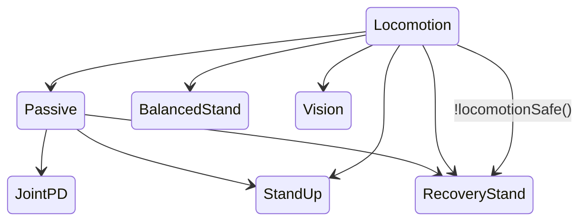

# FSM and behavior

Operation Mode:&#x20;

* Normal,&#x20;
* Transitioning,&#x20;
* Estop,&#x20;
* Edamp: overwrite all command data and generates an emergency damp command using the given gain.

FSM:

* Passive - 0 \*
* Stand up - 1
* Balance stand - 3
* Locomotion - 4
  * Use cMPCOld = [todo-convex-mpc-locomotion.md](todo-convex-mpc-locomotion.md "mention")
  * Start gait with TROT
  * locomotionSafe() check that tilting angle is not too high, leg position good and velocity low
  * [WBC](todo-wbc.md) optional configured by `use_wbc`
* Locomotion test - 5
* Recovery stand - 6
* Vision - 8
* Backflip - 9
* Frontjump - 11
* Joint PD - 51
* Impedance control - 5222k

